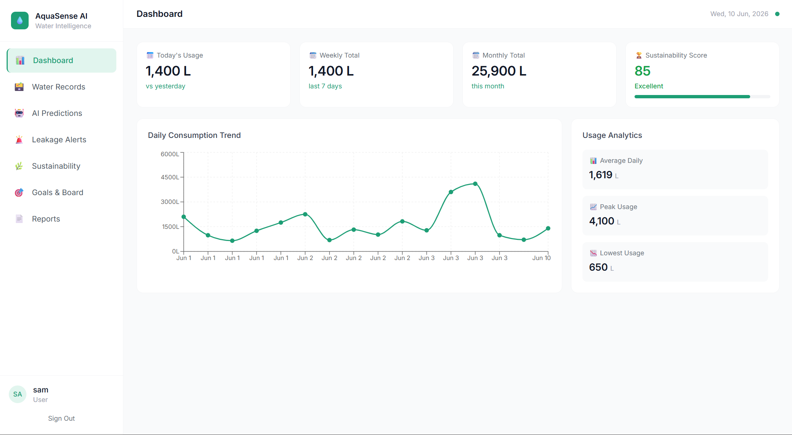
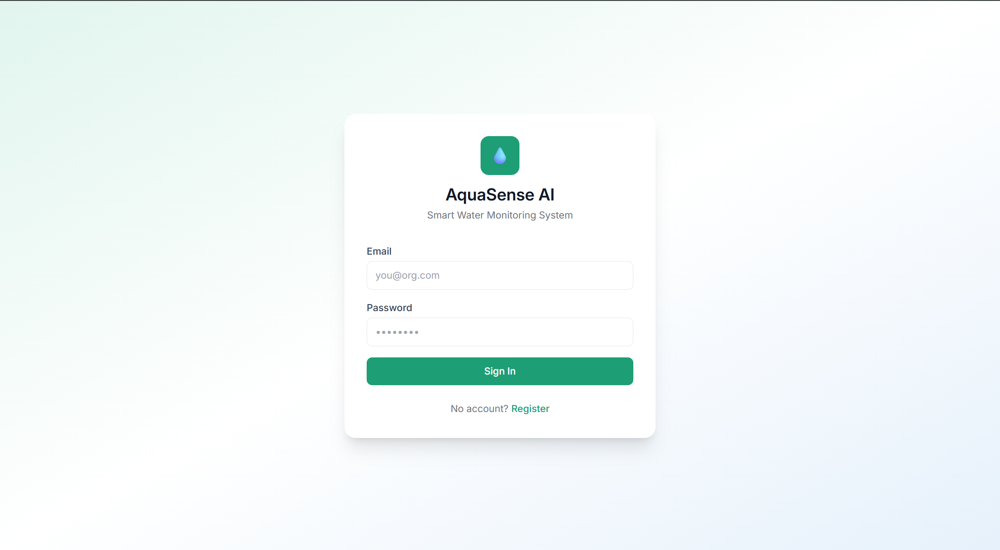

# AquaSense AI – Smart Water Usage Monitoring & Conservation System

> SDG 6 · Clean Water and Sanitation | SDG 11 · Sustainable Cities | SDG 12 · Responsible Consumption

## Tech Stack
- **Frontend** – React 18 + Vite, Tailwind CSS, Recharts, Axios, React Router
- **Backend** – Node.js, Express.js, JWT Auth
- **Database** – MongoDB Atlas + Mongoose
- **AI Service** – Python Flask, Scikit-learn (Linear Regression + Isolation Forest)

## Quick Start

### 1. Clone & Install

```bash
# Backend
cd backend && npm install

# Frontend
cd ../frontend && npm install

# AI Service
cd ../ai-service && pip install -r requirements.txt
```

### 2. Environment Variables

Copy `.env.example` to `.env` in each directory and fill in your values.

**backend/.env**
```
MONGO_URI=mongodb+srv://<user>:<pass>@cluster.mongodb.net/aquasense
JWT_SECRET=your_super_secret_key
PORT=5000
AI_SERVICE_URL=http://localhost:5001
```

**frontend/.env**
```
VITE_API_URL=http://localhost:5000/api
```

**ai-service/.env**
```
PORT=5001
```

### 3. Run Development Servers

```bash
# Terminal 1 – Backend
cd backend && npm run dev

# Terminal 2 – Frontend
cd frontend && npm run dev

# Terminal 3 – AI Service
cd ai-service && python app.py
```

## Screenshots

### Dashboard


### Login Page


## Deployment

| Service      | Platform       |
|-------------|---------------|
| Frontend    | Vercel         |
| Backend     | Render         |
| AI Service  | Render         |
| Database    | MongoDB Atlas  |

### Vercel (Frontend)
```bash
cd frontend && npm run build
# Push to GitHub, connect repo in Vercel dashboard
# Set VITE_API_URL env var to your Render backend URL
```

### Render (Backend & AI)
- Create two Web Services on Render
- Set root directories to `backend/` and `ai-service/`
- Add environment variables in Render dashboard
- Build command: `npm install` / `pip install -r requirements.txt`
- Start command: `node server.js` / `python app.py`

## Features
- JWT Authentication (Register / Login / Protected Routes)
- Water consumption CRUD (date, liters, location, department, notes)
- Dashboard with live charts (daily/weekly/monthly trends)
- AI Predictions – Linear Regression (next day / week / month)
- Leakage Detection – Isolation Forest anomaly detection
- Sustainability Score (0–100) with level labels
- AI Recommendation Engine (dynamic, data-driven)
- PDF Report generation
- Admin Panel (all users, system analytics)
- Conservation Leaderboard
- Water Saving Goal Tracker
- CSV / Excel Import
- Email Alerts (Nodemailer)
- SDG-6 Impact Metrics page

## Project Structure
```
aquasense-ai/
├── frontend/          React + Vite app
├── backend/           Express REST API
├── ai-service/        Flask ML microservice
└── docs/              Architecture diagrams
```
